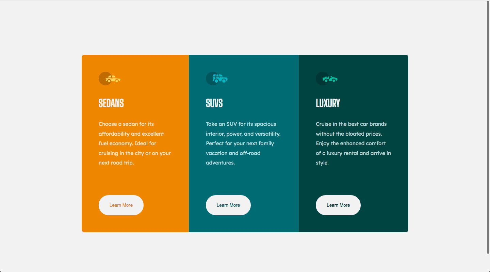

# 3_column_preview_card_component

# Frontend Mentor - 3-column preview card component solution

This is a solution to the [3-column preview card component challenge on Frontend Mentor](https://www.frontendmentor.io/challenges/3column-preview-card-component-pH92eAR2-). Frontend Mentor challenges help you improve your coding skills by building realistic projects. 

## Table of contents

- [Overview](#overview)
  - [The challenge](#the-challenge)
  - [Screenshot](#screenshot)
  - [Links](#links)
- [My process](#my-process)
  - [Built with](#built-with)
  - [What I learned](#what-i-learned)
  - [Continued development](#continued-development)
  - [Useful resources](#useful-resources)
- [Author](#author)
- [Acknowledgments](#acknowledgments)

## Overview

### The challenge

Users should be able to:

- View the optimal layout depending on their device's screen size
- See hover states for interactive elements

### Screenshot

 

### Links

- Solution URL: [https://github.com/Yahyaabbakar92/3_column_preview_card_component]
- Live Site URL: [https://yahyaabbakar92.github.io/3_column_preview_card_component/]

## My process

### Built with

- Semantic HTML5 markup
- CSS custom properties
- Flexbox
- CSS Grid

### What I learned

Here I was coming back to make the card better and responsive as I didn't really make it responsive the first time I submitted it. I 
also learned that I don't need to add a lot to my css when creating a media query. I'm still slightly confused my max-width and min-width, but I'll have this solution as reference.

### Continued development

Although I used flexbox to make this card, I still need to try and use css grid to make it as it should as a few solutions showed such uses. Also needing to understand media queries better.

### Useful resources

## Author

- Frontend Mentor - [@yourusername](https://www.frontendmentor.io/profile/yourusername)

## Acknowledgments

